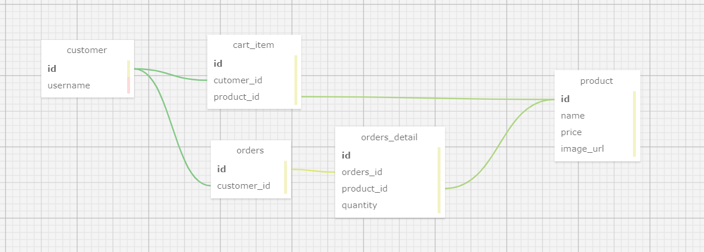

# 장바구니

장바구니 미션 저장소

## 📜 DB 구조

## ✏️1단계 요구 사항

> (e)는 예외 상황

- [x] 회원 가입
    - [x] 계정은 소문자와 숫자만 가능
    - [x] 계정은 4 ~ 15 글자수 제한
    - [x] 계정 앞뒤 공백 제거
    - [x] (e) 계정 중복 불가
    - [x] 닉네임 앞뒤 공백 제거
    - [x] 닉네임은 2 ~ 10 글자수 제한
    - [x] 비밀번호 영어 대문자, 소문자, 숫자 중 2종류 이상을 조합
    - [x] 비밀번호 8 ~ 20 글자수 제한
    - [x] 비밀번호 암호화
    - [x] 주소 앞뒤 공백 제거
    - [x] 주소 최대 255 자
    - [x] 주소 빈 값 불가능
    - [x] 휴대폰 번호 3글자+4글자+4글자 조합
    - [x] (e) 휴대폰 번호에 문자 불가능
- [x] 로그인
    - [x] 계정 ID, 비밀번호 일치 검증
    - [x] 토큰 발급
- [x] 회원 정보 수정
    - [x] 토큰 검증
    - [x] 닉네임 앞뒤 공백 제거
    - [x] 닉네임은 2 ~ 10 글자수 제한
    - [x] 주소 앞뒤 공백 제거
    - [x] 주소 최대 255 자
    - [x] 주소 빈 값 불가능
    - [x] 휴대폰 번호 3글자+4글자+4글자 조합
    - [x] (e) 휴대폰 번호에 문자 불가능
- [x] 회원 정보 조회
    - [x] 토큰 검증
    - [x] 존재하는 회원인지 검증
- [x] 회원 탈퇴
    - [x] 토큰 검증
    - [x] 비밀번호 일치 검증
- [x] 토큰
    - [x] 만료 기간 검증
    - [x] 시그니쳐 일치 검증
    - [x] 토큰에서 계정 정보 추출

## ✏️2단계 요구 사항

> [API 명세서](https://copper-tartan-cd6.notion.site/b9faa19b47f74d28af0ae7432aeacf5b)

- [x] 레거시 API URL 수정
  - [x] 기존 API의 `{customer_name}` 제거
  - [x] 액세스 토큰을 이용해 사용자 구분
- [x] 레거시 API 리팩터링