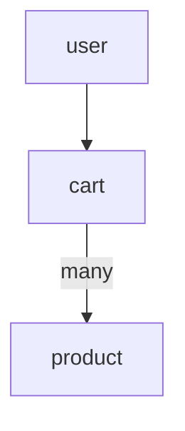
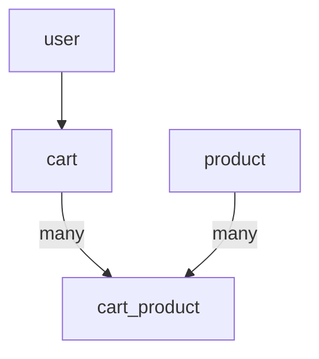

# jwp-shopping-cart

## 기능 목록 Step2

- [ ] settings 페이지 연동
    - [ ] settings.html 변경
- [ ] 장바구니 페이지 연동
    - [ ] cart.html 변경

- [ ] DB 설계

- [ ] 필터 작성

- [ ] User 도메인 추가
    - [ ] User 도메인에 Cart 도메인 추가
- [ ] Cart 도메인 추가

## 기능목록

- [x] 상품 목록 페이지 연동
    - [x] index.html 변경
- [x] 상품 관리 CRUD API 작성
    - [x] create product
    - [x] read product
    - [x] update product
    - [x] delete product
- [x] 관리자 도구 페이지 연동
    - [x] admin.html 변경
    - [x] admin.js 변경

- [x] DB 설계

# 도메인 구조

# DB 설계

