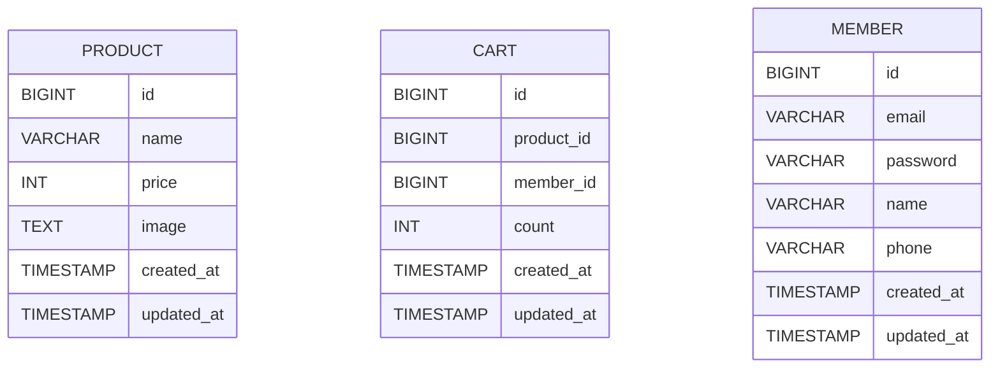

# 요구사항

- [x] 상품 목록 페이지 연동
    - [x] index.html 페이지 구현
- [x] 상품 관리 CRUD API 작성
    - [x] 조회
    - [x] 작성
    - [x] 수정
    - [x] 삭제
- [x] 관리자 도구 페이지 연동
- [x] 상품 테이블을 구성한다.

- [x] 사용자 기능 구현
    - [x] 조회
    - [x] 작성
    - [x] 수정
    - [x] 삭제

- [x] 사용자
    - [x] 이메일 unique
    - [x] 비밀번호
    - [x] 이름
    - [x] 전화번호

- [x] 사용자 설정 페이지 연동
    - [x] `/settings` url 연결

- [x] 장바구니 기능 구현
    - [x] 조회
    - [x] 작성
    - [x] 수정
    - [x] 삭제

- [x] 장바구니 페이지 연동

# API 명세서

## 사용자 API

| Method | URL             | Description |
|--------|-----------------|-------------|
| GET    | `/members`      | 사용자 조회      |
| POST   | `/members`      | 사용자 추가      |
| PUT    | `/members/{id}` | 사용자 수정      |
| DELETE | `/members/{id}` | 사용자 삭제      |

## 상품 API

| Method | URL              | Description |
|--------|------------------|-------------|
| POST   | `/products`      | 상품 작성       |
| PUT    | `/products/{id}` | 상품 수정       |
| DELETE | `/products/{id}` | 상품 삭제       |

## 장바구니 API

| Method | URL           | Description |
|--------|---------------|-------------|
| GET    | `/carts`      | 장바구니 조회     |
| POST   | `/carts`      | 장바구니 추가     |
| PUT    | `/carts/{id}` | 장바구니 수정     |
| DELETE | `/carts/{id}` | 장바구니 삭제     |

# 테이블 명세

