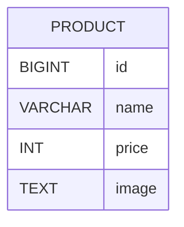

# 요구사항

- [x] 상품 목록 페이지 연동
    - [x] index.html 페이지 구현
- [x] 상품 관리 CRUD API 작성
    - [x] 조회
    - [x] 작성
    - [x] 수정
    - [x] 삭제
- [x] 관리자 도구 페이지 연동
- [x] 상품 테이블을 구성한다.
- [x] 사용자 기능 구현
    - [x] email, password를 기반으로 사용자를 저장한다.
    - [x] email은 중복되지 않는다.
- [ ] 사용자 설정 페이지 연동
    -  [ ] "/settings"로 접근 시 저장된 회원 목록을 보여준다.
    -  [ ] 회원 중 한 명을 선택할 수 있다.

# 2단계 기능구현

- [ ] 장바구니에 아이템을 추가한다.
- [ ] 장바구니 조회 시 인증과정을 거친다.
    - [ ] Basic을 이용해 인증한다.
    - [ ] 잘못된 인증정보일 경우 예외가 발생한다.
- [ ] 장바구니에서 아이템을 삭제할 수 있다.

# API 명세서

## 상품 API

| Method | URL              | Description |
|--------|------------------|-------------|
| POST   | `/products`      | 상품 작성       |
| PUT    | `/products/{id}` | 상품 수정       |
| DELETE | `/products/{id}` | 상품 삭제       |

# 테이블 명세

