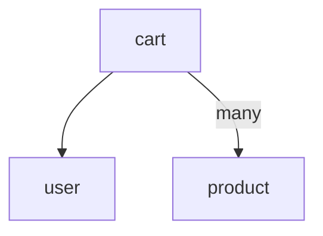
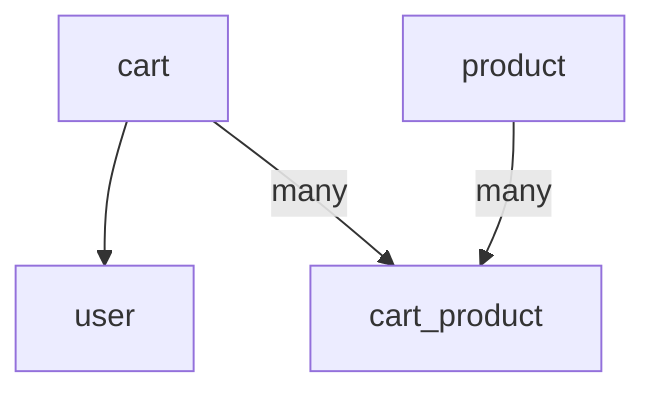

# jwp-shopping-cart

## 기능 목록 Step2

- [x] settings 페이지 연동
    - [x] settings.html 변경
- [x] 장바구니 페이지 연동
    - [x] cart.html 변경

- [x] DB 설계

- [x] 필터 작성

- [x] User 도메인 추가
    - [x] User 도메인에 Cart 도메인 추가
- [x] Cart 도메인 추가

## 기능목록

- [x] 상품 목록 페이지 연동
    - [x] index.html 변경
- [x] 상품 관리 CRUD API 작성
    - [x] create product
    - [x] read product
    - [x] update product
    - [x] delete product
- [x] 관리자 도구 페이지 연동
    - [x] admin.html 변경
    - [x] admin.js 변경

- [x] DB 설계

# 도메인 구조

# DB 설계

