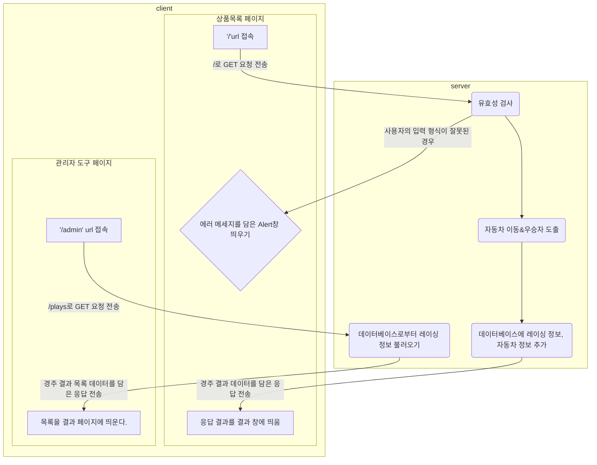

# jwp-shopping-cart

<br>

# 📚 도메인 모델 네이밍 사전

| 한글명  | 영문명     | 설명                | 분류    |
|------|---------|-------------------|-------|
| 상품   | Product | 상품 정보             | class |
| 장바구니 | Cart    | 상품을 담는 장바구니       | class |
| 사용자  | User    | 장바구니 서비스를 이용하는 고객 | class |

<br>

# 🖌️프로그램 흐름도



# 👨‍🍳 기능 목록

## 컨트롤러(Controller)

### 상품 목록 페이지 연동

- [ ] 사용자로부터 GET 요청을 받으면 index.html 페이지를 반환한다.
    ```
  GET / HTTP/1.1
  ```
- [ ] 상품에 대한 데이터를 담을 클래스를 만든다.

### 상품 관리 CRUD API 작성

- [ ] 사용자로부터 POST 요청을 받으면 새 상품을 DB에 저장한다.
- [ ] 사용자로부터 DELETE 요청을 받으면 상품을 DB에서 제거한다.
- [ ] 사용자로부터 PUT 요청을 받으면 상품의 정보를 수정하여 DB에 저장한다.

### 관리자 도구 페이지 연동

## DB(DAO)

- H2 데이터베이스를 사용한다.
- DB 테이블 설계
    - Database 명 : `shopping_cart`
        - Table 명 : `product`

          | id | name | image | price |
          |----|---------|------------|-------|
          | 1 | chicken | https://... | 10000 |
          | 2 | pizza | https://... | 12000 |
        - Table 명 : `user`

# 프로그래밍 요구사항

- 도메인의 의존성을 최소한으로 구현한다.
- 한 줄에 점을 하나만 찍는다.
- 게터/세터/프로퍼티를 쓰지 않는다.
- 모든 객체지향 생활 체조 원칙을 잘 지키며 구현한다.
- 프로그래밍 체크리스트의 원칙을 지키면서 프로그래밍 한다.

# 📌 Commit Convention

커밋 메시지는 다음과 같은 형태로 작성합니다.

```Bash
> "커밋의 타입: 커밋 메세지 내용"
ex) "docs: 기능 목록 추가"
```

커밋의 타입은 아래 10가지 중 가장 적절한 것을 선택해 작성합니다.

|  커밋의 타입  |              설명               |
|:--------:|:-----------------------------:|
|   feat   |           새로운 기능 추가           |
|   fix    |             버그 수정             |
| comment  |        필요한 주석 추가 및 변경         |
|   test   |           테스트 코드 추가           |
|   docs   | 문서를 추가 혹은 수정 (ex. README 수정)  |
|  rename  |    파일 혹은 폴더명을 수정하거나 옮기는 작업    |
|  remove  |        파일을 삭제하는 작업만 수행        |
|  chore   |   빌드 태스크 업데이트, 패키지 매니저를 설정    |
| refactor |            코드 리팩토링            |
|  style   | 코드 포맷팅, 세미콜론 누락, 코드 변경이 없는 경우 |

- 상세한 컨벤션
  내용은 [Angular JS Git Commit Message Conventions](https://gist.github.com/stephenparish/9941e89d80e2bc58a153)
  를 참고

<br>

# 📌 Code Convention

- 구글 Java 코딩 컨벤션을 준수합니다.
- IntelliJ의 Formatter를 적용합니다.

